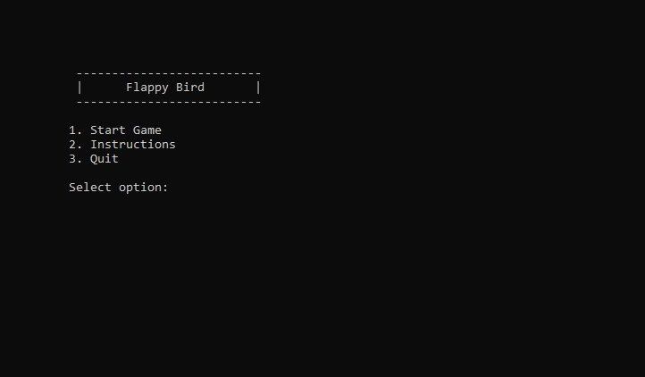

# AI Flappy Bird

# Inspirations #
https://github.com/hamikm/AsciiBird

https://www.youtube.com/watch?v=yASrfF1C3ms

# Setup # 
> ⚠️ Game will work NOT work on online compilers and on Mac OS.

Compile the `birdgame.cpp` file found in the `birdgame` folder.

# How to play #
1. Single player mode : Press spacebar to jump.
2. AI mode : watch AI bird play but keep in mind that the AI bird will never die.

# Future work #
- [x] Add gameplay to README
- [x] Remove unicode characters so that code can run on IDE not supporting unicode.
- [x] Add code to get rid of flickering cursor 
- [x] Add AI bird
- [x] Fix collision bug (when bird is between 2 pipes, it can partially collide with the bottom pipe.)

- [ ] Add code explanation with diagram
- [ ] Add flapping wings to [bird](https://imgur.com/gallery/gKpkYqL).
- [ ] Add different difficulty modes (vary gap between pipes, speed of bird, ...)

