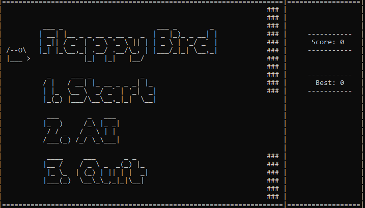

# Usage #
> ⚠️ Unfortunately, this game will work only on a Windows system because of some Windows-specific libraries used.

- Run `birdgame.cpp` using a compiler that supports C++14.
- On startup screen, choose an option by pressing `1` or `2` or `3`.
- When in single player mode, press `spacebar` to jump. 
- In AI mode you can only watch AI play:

# How it works #

- At any time, there are at most 2 pipes on screen. 
- The bird only moves vertically while the pipes move horizontally to the left. 
- `pipe[0]` always denotes the index of the pipe closest to the bird. Once this pipe is behind the bird, it is removed from screen and a new one is created.

# Inspirations #
https://github.com/hamikm/AsciiBird

https://www.youtube.com/watch?v=yASrfF1C3ms

# Future work #
- [ ] Add flapping wings to [bird](https://imgur.com/gallery/gKpkYqL).
- [ ] Add different difficulty modes (vary gap between pipes, speed of bird, ...)

