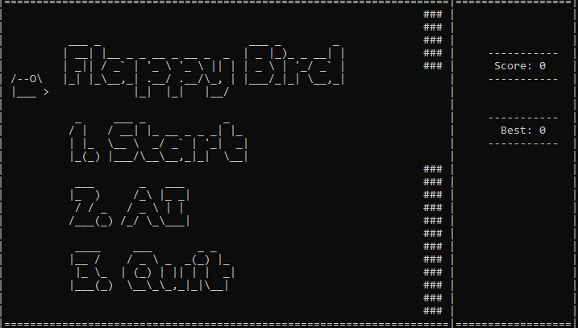

# Flappy Bird

# Setup # 
Run `flappybird.cpp`

This program will not run on online compilers as it uses non standard `conio.h` and `dos.h` header files.

# Future work #
- [x] Add gameplay to README
- [ ] Remove unicode characters
- [ ] Fix collision bug (when bird is between 2 pipes, it can partially collide with the bottom pipe.)
- [ ] Fix pipe flickering problem using double buffering
- [ ] Add flapping wings to [bird](https://imgur.com/gallery/gKpkYqL).
- [ ] Add AI bird
- [ ] Add different difficulty modes (vary gap between pipes, speed of bird, ...)
